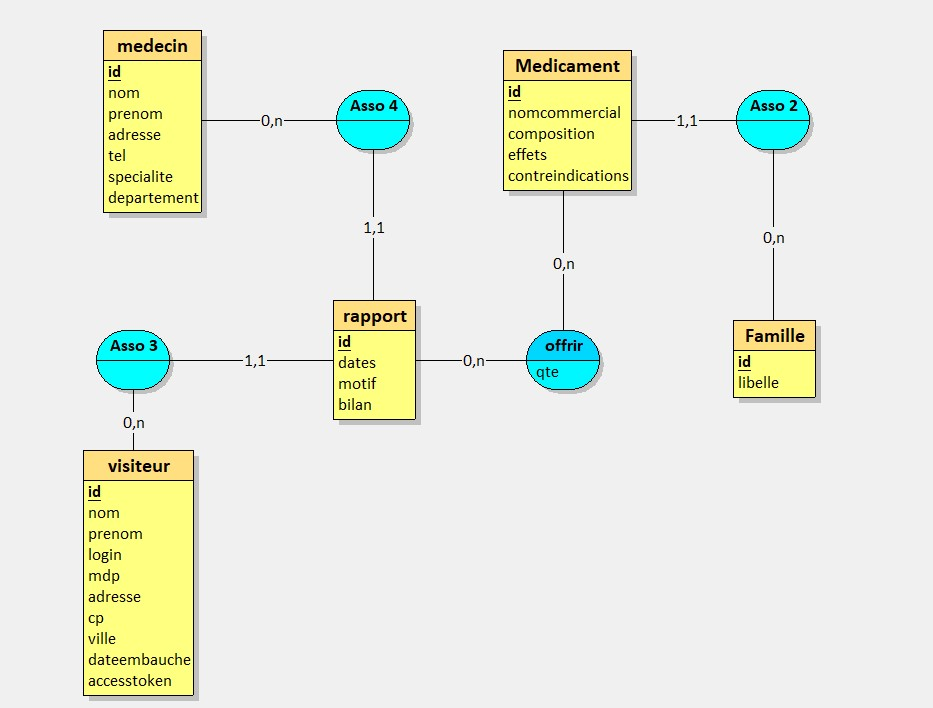

# API Gestion Rapports Médicaux - GSB Doctors

API REST complète pour gérer les rapports de visite médicale des visiteurs, les médecins et les familles de médicaments. Construite avec **Node.js**, **Express**, **TypeScript** et **Prisma ORM**.

## 📋 Table des matières

- [Prérequis](#prérequis)
- [Installation](#installation)
- [Configuration](#configuration)
- [Démarrage](#démarrage)
- [Architecture](#architecture)
- [Schéma de la Base de Données](#schéma-de-la-base-de-données)
- [Endpoints](#endpoints)
- [Documentation API](#documentation-api)
- [Authentification](#authentification)

## 🔧 Prérequis

- **Node.js**
- **npm** 
- **Docker** et **Docker Compose** (recommandé pour la base de données)

## 📦 Installation

```bash
# Cloner le repository
git clone <repo-url>
cd GSB_DOCTORS_Back-End

# Installer les dépendances
npm install
```

## ⚙️ Configuration

### 1. Variables d'environnement

Créer un fichier `.env` à la racine du projet :

```env
# Base de données
DB_HOST=db
DB_NAME=gsbrapports
DB_USER=ADN
DB_PASSWORD=FeKl%KfF*Bp6J:p$:%NF
DB_PORT=3306
DATABASE_URL="mysql://ADN:FeKl%KfF*Bp6J:p$:%NF@db:3306/gsbrapports"

# JWT
JWT_SECRET=your-super-secret-jwt-key-change-this-in-production-12345
```

### 2. Base de données avec Docker Compose (recommandé)

**Démarrer l'infrastructure complète :**

```bash
docker-compose up -d
```

Cette commande crée :
- **db** (MySQL 8.0) : Base de données `gsbrapports` 
  - Utilisateur : `ADN`
  - Mot de passe : `FeKl%KfF*Bp6J:p$:%NF`
  - Port : `3306`
  - **Les tables et données sont initialisées automatiquement** via le dump SQL (`/docker-entrypoint-initdb.d`)
  
- **app** (Node.js 22) : Serveur application
  - Port : `3000`
  - Lance automatiquement : `npm install && npx prisma generate && npm run dev`
  
- **adminer** : Interface web pour gérer la BDD
  - URL : `http://localhost:8080`


## 🚀 Démarrage

### Avec Docker Compose (recommandé)

```bash
cd GSB_DOCTORS_Back-End

# Démarrer tous les services (db, app, adminer) - au premier lancement
docker-compose up -d

# Vérifier que tout est prêt
docker-compose logs -f app

# ⚠️ Après modification du code, utiliser --build
docker-compose up -d --build
```
(si la syntaxe "docker-compose" pose problème essayer les memes commandes en retirant le tiret entre les 2 mot : "docker compose")

L'application sera disponible sur :
- 🌐 **API** : `http://localhost:3000`
- 📚 **Swagger** : `http://localhost:3000/api-docs`
- 🗄️ **Adminer** : `http://localhost:8080` (user: `ADN`, pass: `FeKl%KfF*Bp6J:p$:%NF`, db: `gsbrapports`)

Le serveur démarre sur `http://localhost:3000` et la documentation Swagger sur `http://localhost:3000/api-docs`

## 🏗️ Architecture

```
GSB_DOCTORS_Back-End/
├── src/
│   ├── controllers/       # Logique des requêtes HTTP
│   ├── routes/            # Définition des endpoints
│   ├── services/          # Logique métier et accès aux données
│   ├── models/            # Interfaces et types TypeScript
│   ├── middleware/        # Middleware Express
│   ├── db/                # Configuration BDD
│   ├── utils/             # Utilitaires
│   ├── swagger.ts         # Configuration Swagger/OpenAPI
│   ├── error.ts           # Classes d'erreurs
│   └── prisma.ts          # Client Prisma
├── prisma/
│   └── schema.prisma      # Schéma de la base de données
├── logs/                  # Fichiers de logs
├── docker-compose.yml     # Configuration Docker Compose
├── GSB_Doctors.loo        # Diagramme complet de l'application
└── package.json
```
## Diagramme des Use Case 


## � Schéma de la Base de Données

### Vue d'ensemble des relations



## �🔒 Sécurité & Contrôle d'accès

### Modèle de sécurité

L'application implémente un **contrôle d'accès basé sur l'utilisateur** (user-scoped access control) :

- **Rapports** : Chaque visiteur ne peut voir/modifier/supprimer que **ses propres rapports**
- **Offres** : Chaque visiteur ne peut voir/modifier/supprimer que les offres de **ses rapports**
- **Vérification** : À chaque opération, on vérifie que `rapport.idvisiteur === utilisateur.id`

### Implémentation technique

**Couche Service** : Deux ensembles de fonctions

1. **Fonctions filtrées (avec contrôle d'accès)** :
   - `getAllRapportsByVisiteur(visiteurId)` - Aucun accès non authentifié
   - `getRapportByIDAndVisiteur(id, visiteurId)` - Jette `UnauthorizedError` si pas propriétaire
   - `getAllOffreByVisiteur(visiteurId)` - Accès filtré
   - `getOffreByIDAndVisiteur(idrapport, idmedicament, visiteurId)` - Vérification complète
   - Etc.

2. **Fonctions originales (sans filtre)** :
   - `getAllRapports()` - Toutes les données
   - `getRapportByID(id)` - Sans contrôle d'accès
   - `getAllOffre()` - Toutes les données
   - Etc. *(Réservées pour un potentiel accès admin futur)*

**Couche Contrôleur** :
- Extraction du token JWT via `req.visiteur` (défini par le middleware `authHandler`)
- Appel des fonctions **filtrées** avec l'ID de l'utilisateur
- Gestion des erreurs : `UnauthorizedError` si accès refusé

**Couche Route** :
- Middleware `isloggedOn` pour les routes protégées
- Documentation Swagger avec mention explicite de la viscosité (ex: "**vos** rapports")

### Contrôle d'accès par endpoint

| Endpoint | Visiteur A peut accéder à | Visiteur B peut accéder à |
|----------|---------------------------|--------------------------|
| GET /api/rapports | Ses rapports seulement | Ses rapports seulement |
| GET /api/rapports/:id | Un de ses rapports | Jette UnauthorizedError |
| POST /api/rapports | Force son ID visiteur | Force son ID visiteur |
| PUT /api/rapports/:id | Modifie ses rapports | Jette UnauthorizedError |
| GET /api/offrir | Ses offres seulement | Ses offres seulement |
| GET /api/medecins | affiche la liste complète | affiche la liste complète |

## 📡 Endpoints

### Authentification & Visiteurs (`/api/visiteurs`)
- `POST /api/visiteurs/login` - Connexion (génère un HttpOnly Cookie avec JWT)
- `POST /api/visiteurs/inscription` - Création compte
- `GET /api/visiteurs/account` - Récupérer ses infos (protégé, utilise le token)
- `PUT /api/visiteurs/account` - Modifier son compte (protégé)
- `DELETE /api/visiteurs/account` - Supprimer son compte (protégé)
- `GET /api/visiteurs` - Lister tous (protégé)
- `GET /api/visiteurs/:id` - Détails (protégé)

### Familles de médicaments (`/api/familles`)
- `GET /api/familles` - Lister toutes
- `GET /api/familles/:id` - Détails
- ⚠️ POST, PUT, DELETE - Commentées (conservées pour utilisation future)

### Médicaments (`/api/medicaments`)
- `GET /api/medicaments` - Lister tous
- `GET /api/medicaments/:id` - Détails
- ⚠️ POST, PUT, DELETE - Commentées (conservées pour utilisation future)

### Médecins (`/api/medecins`)
- `GET /api/medecins` - Lister tous (public)
- `GET /api/medecins/:id` - Détails avec les rapports associés (public)
- `GET /api/medecins/search?search=<nom>` - Rechercher par nom (publique)
- ⚠️ POST, PUT, DELETE - Commentées (conservées pour utilisation future)

### Rapports de visite (`/api/rapports`)

**Accès utilisateur (scoped)** - Voir seulement ses rapports :
- `GET /api/rapports` - Lister ses rapports
- `GET /api/rapports/:id` - Détails d'un de ses rapports
- `GET /api/rapports/date?date=YYYY-MM-DD&idvisiteur=X` - Rapports d'une date spécifique
  - Paramètres :
    - `date` (requis) : Format YYYY-MM-DD (ex: "2024-01-15")
    - `idvisiteur` (optionnel) : ID du visiteur. Si omis, utilise l'utilisateur connecté
- `POST /api/rapports` - Créer un rapport (forcer son propre ID visiteur)
- `PUT /api/rapports/:id` - Modifier un de ses rapports
- `DELETE /api/rapports/:id` - Supprimer un de ses rapports

**Routes originales (toutes les données)** - Conservées pour potentiel accès admin futur :
- `getAllRapports()` - Tous les rapports
- `getRapportByID()` - Détails (sans contrôle d'accès)
- `createRapport()` - Créer (sans forcer visiteur)
- `updateRapportByID()` - Modifier
- `deleteRapportByID()` - Supprimer

### Offres de médicaments (`/api/offrir`)

**Accès utilisateur (scoped)** - Voir seulement ses offres :
- `GET /api/offrir` - Lister ses offres (rapports de l'utilisateur)
- `GET /api/offrir/:idRapport/:idMedicament` - Détails d'une offre (vérification d'appartenance)
- `POST /api/offrir` - Créer une offre pour ses rapports
  - **Important** : Le rapport doit appartenir à l'utilisateur
- `PUT /api/offrir/:idRapport/:idMedicament` - Modifier une offre (vérification d'appartenance)
- `DELETE /api/offrir/:idRapport/:idMedicament` - Supprimer une offre (vérification d'appartenance)

**Routes originales (toutes les données)** - Conservées pour potentiel accès admin futur :
- `getAllOffre()` - Toutes les offres
- `getOffreByID()` - Détails (sans contrôle d'accès)
- `createOffre()` - Créer
- `updateOffreById()` - Modifier
- `deleteOffreByID()` - Supprimer

## 📚 Documentation API

La documentation interactive est disponible via **Swagger UI** :

```
http://localhost:3000/api-docs
```

## 🔐 Authentification

L'API utilise **JWT (JSON Web Tokens)** stockés dans des **HttpOnly Cookies** pour la sécurité.

### Mécanisme de sécurité

- **Stockage** : Les tokens JWT sont stockés dans des HttpOnly Cookies (non accessibles au JavaScript côté client)
- **Drapeaux de sécurité** :
  - `HttpOnly` : Protège contre les attaques XSS
  - `Secure` : Transmission HTTPS uniquement (production)
  - `SameSite=strict` : Protection CSRF
- **Durée de vie** : 15 minutes
- **Refresh** : Fenêtre glissante - le token est régénéré à chaque requête authentifiée si valide
- **Hachage des mots de passe** : bcryptjs avec salt rounds configurés

### Routes publiques (sans authentification)

- `GET /api/medecins` - Lister tous les médecins
- `GET /api/medecins/:id` - Détails d'un médecin (avec rapports associés)
- `GET /api/medecins/search?search=...` - Rechercher un médecin par nom
- `POST /api/visiteurs/login` - Connexion
- `POST /api/visiteurs/inscription` - Création compte

### Routes protégées (authentification requise)

Toutes les autres routes nécessitent un token JWT valide. Le token est automatiquement géré via les HttpOnly Cookies.

## 🗄️ Base de données avec Prisma

### Modèles de données

- **Famille** : Catégories de médicaments
- **Medicament** : Médicaments disponibles
- **Medecin** : Médecins
- **Visiteur** : Représentants commerciaux
- **Rapport** : Rapports de visite
- **Offrir** : Médicaments offerts (clé composée)

### Commandes Prisma

```bash
npx prisma generate         # Générer le client (automatique avec Docker)
npx prisma db push          # Synchroniser le schéma avec la DB
npx prisma studio          # Interface graphique (http://localhost:5555)
npx prisma migrate reset   # Réinitialiser DB (supprime les données)
```

### Initialisation de la base de données

**Avec Docker Compose** (automatique) :
- Le fichier `script_sql/gsbrapports.sql` est copié dans `/docker-entrypoint-initdb.d/`
- MySQL l'exécute automatiquement au premier démarrage du conteneur
- Aucune action manuelle requise

### Script init-db.sh

Le script `scripts/init-db.sh` est **optionnel** et ne s'exécute plus automatiquement avec Docker Compose. 

Il reste disponible pour :
- Regénérer le client Prisma : `npx prisma generate`
- Lancer l'app en développement local : `npm run dev`

Utilisation manuelle :
```bash
bash scripts/init-db.sh
```

## 🐳 Docker & Docker Compose

### Architecture

Le fichier `docker-compose.yml` orchestre 3 services :

```yaml
db          # MySQL 8.0 - Gère l'import SQL automatiquement
├─ Volumes: ./script_sql:/docker-entrypoint-initdb.d
└─ MySQL exécute auto tous les fichiers .sql au premier démarrage

app         # Node.js 22 - Application Express/Prisma
├─ Dépend de: db (condition: service_healthy)
├─ Command: npm install && npx prisma generate && npm run dev
└─ Attend que la DB soit prête via healthcheck

adminer     # Interface web pour gérer la BDD
├─ Dépend de: db
└─ Port: 8080
```

### Commandes essentielles

```bash
# Démarrer tous les services en arrière-plan
docker-compose up -d --build

# Voir les logs en direct
docker-compose logs -f           # tous les services
docker-compose logs -f app       # juste l'app
docker-compose logs -f db        # juste la db

# Arrêter proprement
docker-compose down

# Arrêter ET supprimer les données
docker-compose down --volumes

# Redémarrer avec rebuild (après changement du code)
docker-compose up --build

# Vérifier l'état
docker-compose ps
```

### Structure des volumes

```
script_sql/                          # Dossier local
├── gsbrapports.sql                  
└── ...
    ↓
/docker-entrypoint-initdb.d/         # Inside container
```

MySQL exécute automatiquement tous les fichiers `.sql` du dossier `initdb.d` au **premier démarrage seulement**. 

**Important** : Le dossier `db_data` (volume persistant) conserve les données même après `docker-compose down`. Pour un reset complet : `docker-compose down --volumes --remove-orphans`

### Résolution de problèmes Docker

```bash
# Logs complets (avec erreurs MySQL)
docker-compose logs db

# Vérifier que les fichiers SQL sont bien répliqués
docker-compose exec db ls -la /docker-entrypoint-initdb.d

# Accéder au conteneur
docker-compose exec app bash
docker-compose exec db mysql -u ADN -p gsbrapports

# Nettoyer complètement (si l'état est corrompu)
docker system prune -af --volumes
docker-compose up --build
```

## ✅ Commandes npm

```bash
npm run dev      # Développement
npm run build    # Build
npm start        # Production
```

## 🚀 Déploiement en pré-production

### Avec Docker Compose (recommandé)

La configuration `docker-compose.yml` est prête pour un déploiement simple :

```bash
# Clone et démarrage
git clone <repo-url>
cd GSB_DOCTORS_Back-End
docker-compose up -d

# Vérifier la santé
docker-compose ps
docker-compose logs app
```

### Dockerfile personnalisé (optionnel)

Si vous préférez un build custom :

```dockerfile
FROM node:22-alpine

WORKDIR /app

# Installer les dépendances
COPY package*.json ./
RUN npm ci --omit=dev

# Copier le code et Prisma
COPY . .
RUN npx prisma generate

# Build TypeScript
RUN npm run build

# Exposer le port
EXPOSE 3000

# Démarrer l'application
CMD ["npm", "start"]
```

Build et run :

```bash
docker build -t gsb-doctors-api .
docker run -p 3000:3000 --env-file .env gsb-doctors-api
```

### Variables d'environnement production

```env
NODE_ENV=production
DATABASE_URL=mysql://ADN:FeKl%KfF*Bp6J:p$:%NF@db-hostname:3306/gsbrapports
JWT_SECRET=your-long-random-secret-key-with-enough-entropy-for-production
```

## 📝 Logs

Les logs sont stockés dans le dossier `logs/`

## 📄 Licence

MIT
